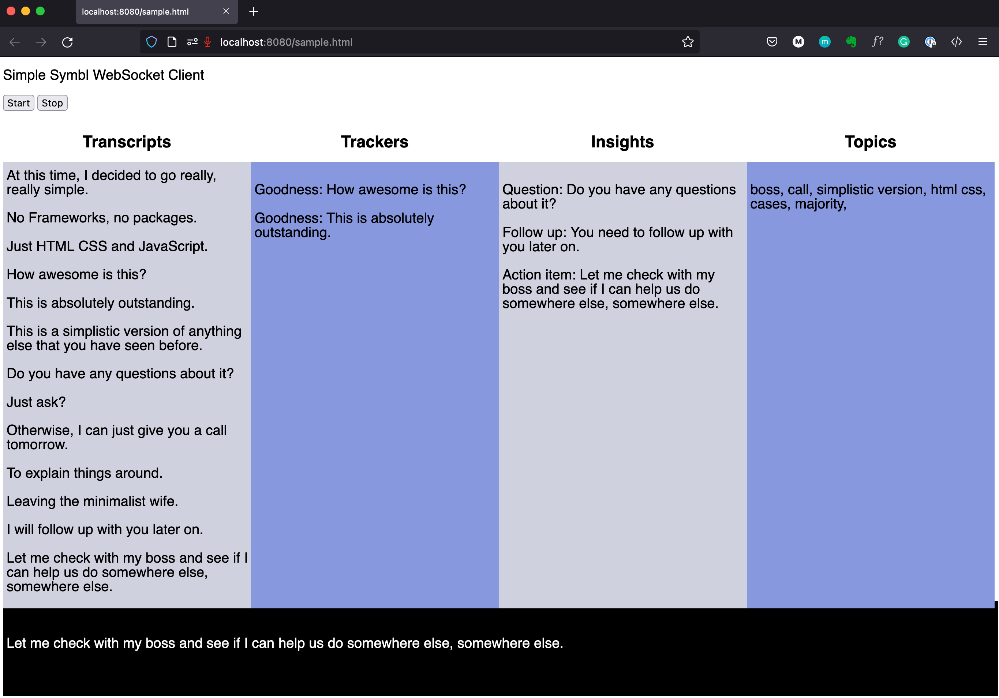

# Simple Symbl Web Client Application

## What is it?
A simple web app with no dependencies, no frameworks and no packages... pure HTML, JavaScript and CSS, enabling [Symbl.ai](https://symbl.ai/) to capture the audio stream and provide [speech-to-text (closed captions and transcriptions), insights, topics and trackers](https://docs.symbl.ai/docs).

## How to set it up and run it?

1. Update the sample.html file with your [Symbl access token](https://docs.symbl.ai/docs/developer-tools/authentication). 
1. To run a web server on your own machine, you can use the NPM command line utility called [http-server](https://www.npmjs.com/package/http-server) or the [Python's http.server module](https://developer.mozilla.org/en-US/docs/Learn/Common_questions/set_up_a_local_testing_server#running_a_simple_local_http_server).
1. Make sure you run one of the utilities above in the same directory you have cloned this project.
1. Go to your web browser of choice and open up the sample.html page (i.e. http://localhost:8080/sample.html).
1. Press the `start` button, allow your web browser to capture the audio from your microphone and speak normally. Enjoy the results showing up in the different sections of the web page.
1. Press the `stop` button to stop the WebSocket connection.

